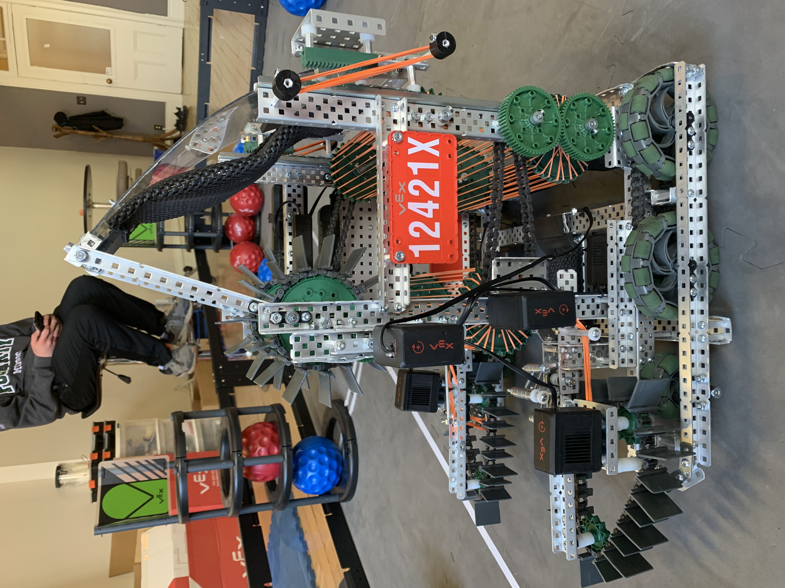

# ⚙️ 12421X 🤖
## This is the repository for Northern Robotics' 2020/2021 Vex Robotics Code. 
### Team: JJ Doleweerd, Zac Waite, Ryan Doleweerd, Ethan Sheppard

### We competed at the Vex Robotics LRT world championships in 2021.

<table>
	<tr>
		<td>
			
		</td>
		<td>
			
		</td>
	</tr>
	<tr>
		<td>
			
		</td>
		<td>
			
		</td>
	</tr>
	<tr>
		<td>
			
		</td>
		<td>
			
		</td>
	</tr>
	<tr>
		<td>
			
		</td>
		<td>
			
		</td>
	</tr>

</table>